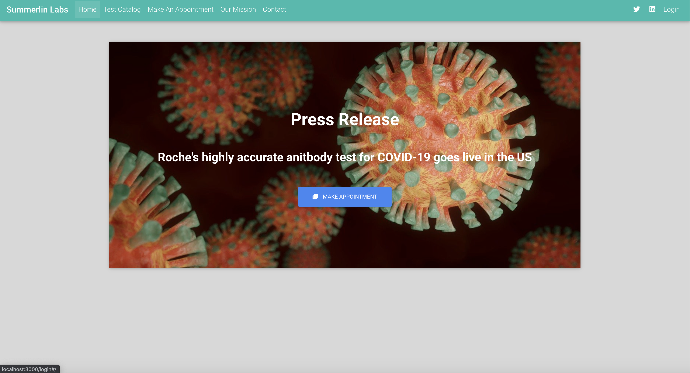
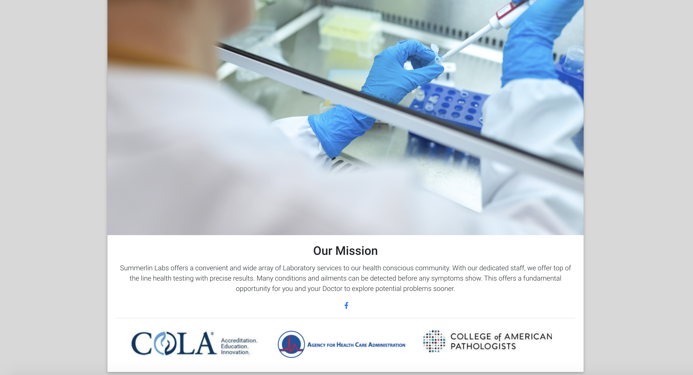
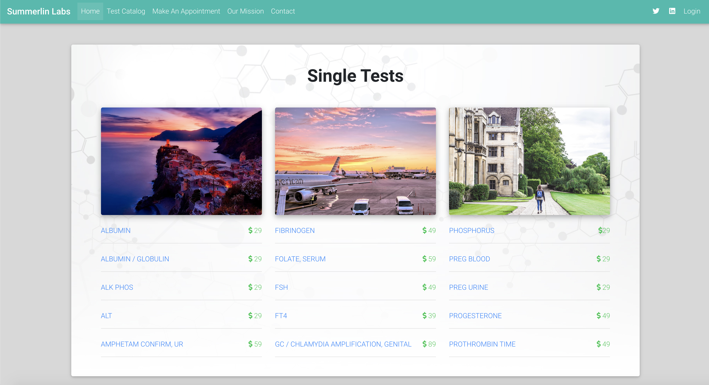
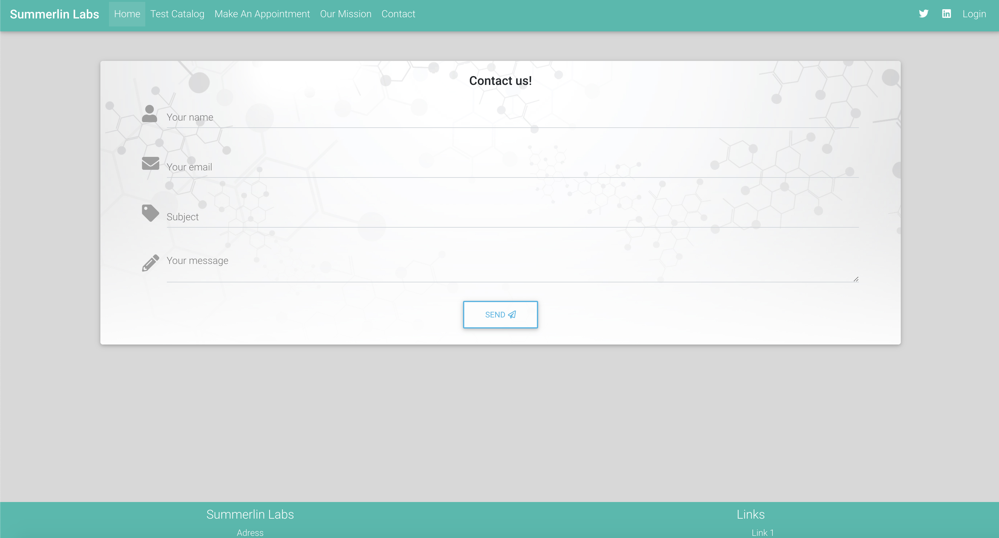
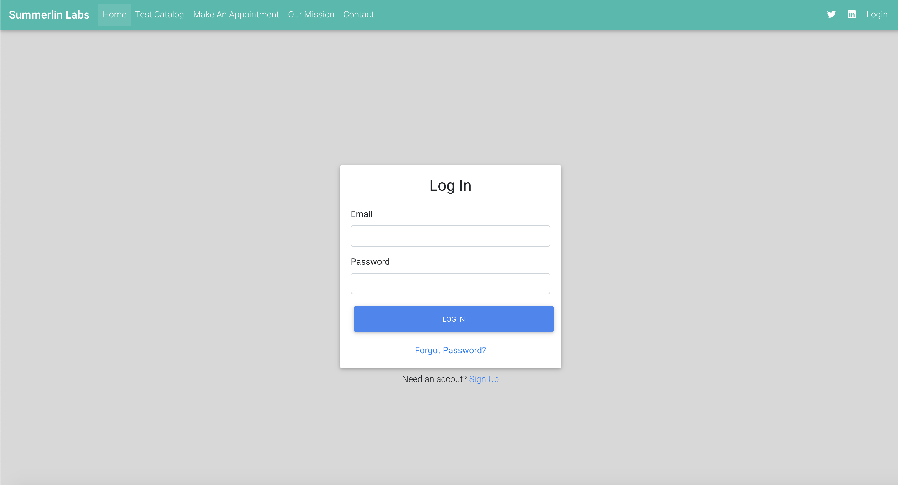

# Summerlin Labs

# Table of Contents

* [Description](#Description)
* [Issues](#Issues)
* [Video](#Video)
* [Link](#Link)
* [Screenshot](#Screenshot)

## Description
* Web application for a medical lab that has an array of testing including COVID-19. The website highlights the availables tests, making an appointment, mission statement, and a contact page.

## Issues
* Bit of a tough time deploying to Heroku but we managed. 
* Figuring out how to make a multidute of react.js components work together was also tough but very rewarding.

## Future-Plans
* Adding admin profiles where they are able to see test results
* Client profiles where they can see their individual results
* Scheduling appointments for corporate testing
* Host it with a proper URL

## Link 

[Summerlin Labs Link](https://lit-thicket-62279.herokuapp.com/#/)

## Screenshot

